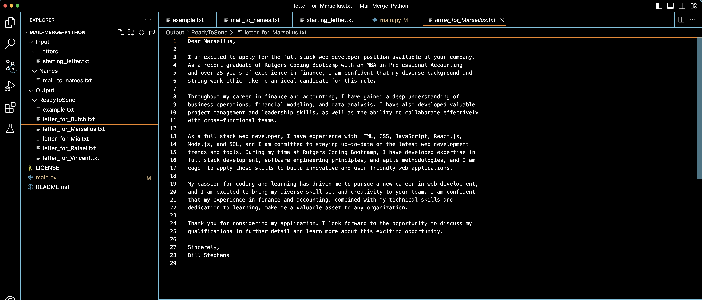

# Mail Merge 

  ## Description

  This is a simple Python script that will create letters to all the names in a list.  In the screenshot below, a cover letter for a job application was provided along with a list of names - The Python script generated a letter addressed to each name in the list.

  Screenshot:

  

  
  ## Table of Contents
  
  - [Installation](#installation)
  - [Usage](#usage)
  - [License](#license)
  - [Contributing](#contributing)
  - [Tests](#tests)
  - [Questions](#questions)
  
  ## Installation
  
  run main.py in the terminal
  
  ## Usage
  
  Update the contents in the 'Input Folder' - update the starting_letter.txt with a letter of your choice with 'Dear [name]' as the header.  Update the mail_to_names.txt with a list of names you would like the letters to be addressed to.  The Python script will create a letter addressed to each name in the Output folder.  The Python script looks for '[name]' and replaces it with the names provided in the list.

  ## License
This application is covered under the MIT License.
 For more information: https://opensource.org/licenses/MIT
  
  ## Contributing
  N/A
  
  ## Tests
  N/A

  ## Questions
  Contact Info 
  GitHub user name: BillStephens2022 
  Link to GitHub profile: https://github.com/BillStephens2022 
  Email: stephensbill17@gmail.com